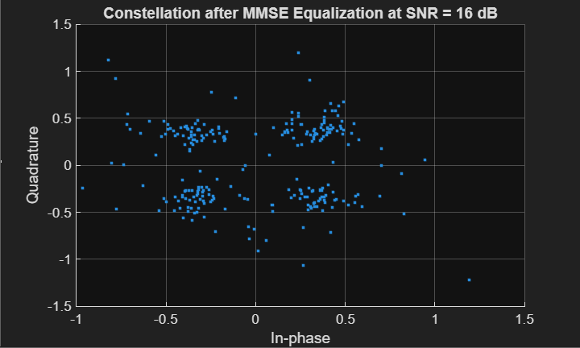

# 4×4 MIMO-OFDM Wireless Communication System Simulation

## Overview
This MATLAB project simulates a **4×4 MIMO-OFDM wireless communication system** over a **frequency-selective Rayleigh fading channel**, emulating real-world 4G LTE and 5G NR systems. The system implements **QPSK modulation**, **pilot-based LS channel estimation**, and **MMSE equalization**, and evaluates performance through **Bit Error Rate (BER)**, **average system capacity**, and **per-subcarrier SNR/capacity**.

The simulation demonstrates how MIMO and OFDM techniques improve link reliability, spectral efficiency, and robustness against multipath fading.

---

## Features

- **System Configuration**
  - 4×4 MIMO setup (Tx × Rx antennas)
  - 64 OFDM subcarriers with 16-sample cyclic prefix
  - QPSK modulation (extendable to higher-order QAM)
  - Pilot-based Least Squares (LS) channel estimation
  - MMSE equalization per subcarrier

- **Channel Model**
  - Frequency-selective Rayleigh fading with 6 taps
  - Exponential Power Delay Profile (PDP)
  - Additive White Gaussian Noise (AWGN)

- **Performance Metrics**
  - BER vs SNR
  - Average system capacity
  - Per-subcarrier SNR and capacity
  - Constellation diagram after equalization

- **Extensible**
  - Can extend to 16-QAM, 64-QAM
  - Supports adaptive bit loading, advanced equalizers, and channel coding (LDPC, Turbo)

---

## Installation & Requirements

- **MATLAB R2019b or later** (recommended)
- No additional toolboxes required; standard MATLAB functions used
- Clone or download the repository:

```bash
git clone <your-github-link>
```

---

## Usage

1. Open MATLAB and navigate to the project folder.

2. Run the main script:

```matlab
run('MIMO_OFDM_Simulation.m');
```
3. The script will generate the following outputs:

  - BER vs SNR plot
  - Average Capacity vs SNR plot
  - Per-subcarrier SNR and capacity distribution plots
  - QPSK constellation diagram after MMSE equalization

4. Adjust parameters such as subcarriers, Tx, Rx, SNR range, or modulation order as needed.  

---

## Plots & Visualizations

1. **BER vs SNR**  
   Shows how BER decreases with increasing SNR and confirms the MMSE equalizer effectively mitigates channel noise.  

   

2. **Average Capacity vs SNR**  
   Demonstrates logarithmic growth of system capacity and highlights the spatial multiplexing gain of a 4×4 MIMO system.  

   

3. **Constellation Diagram (Post-MMSE Equalization)**  
   Shows QPSK symbols converging to ideal points and confirms the accuracy of channel estimation and equalization.  

   

---

## Sample Results

| SNR (dB) | BER       | Avg. Capacity (bits/sec/Hz) |
|-----------|-----------|-----------------------------|
| 0         | 4.27e-01  | 20.67                       |
| 4         | 3.98e-01  | 42.72                       |
| 8         | 3.44e-01  | 48.66                       |
| 12        | 2.26e-01  | 54.86                       |
| 16        | 1.58e-01  | 60.06                       |
| 20        | 8.61e-02  | 64.17                       |
| 24        | 5.35e-02  | 69.84                       |

Plots and the full MATLAB script are included in this repository.

---

## References

- NPTEL Course: *Principles of Modern CDMA/MIMO/OFDM Wireless Communications*, IIT Kanpur  
- D. Tse and P. Viswanath, *Fundamentals of Wireless Communication*, Cambridge University Press, 2005  
- MATLAB Documentation: MIMO-OFDM System Simulation Functions  

## Author

**Akshat Gupta**  
B.Tech, Electronics & Communication Engineering  
JSS Academy of Technical Education, Noida, India  
Email: akshat.137.0309@gmail.com  

## License

This project is released under the [MIT License](https://opensource.org/licenses/MIT).
